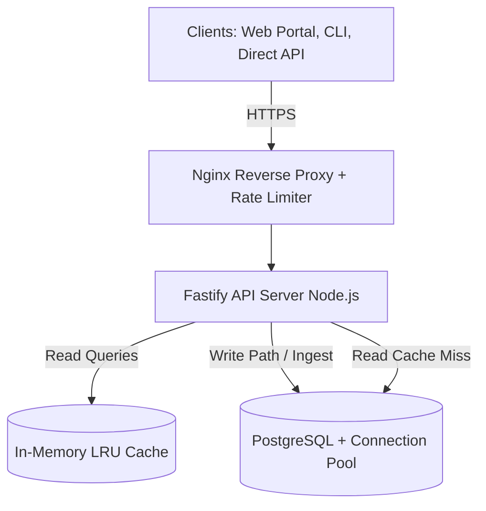
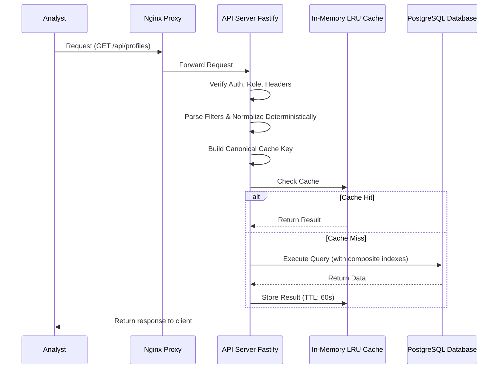
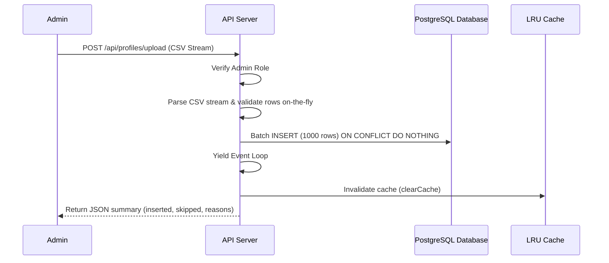
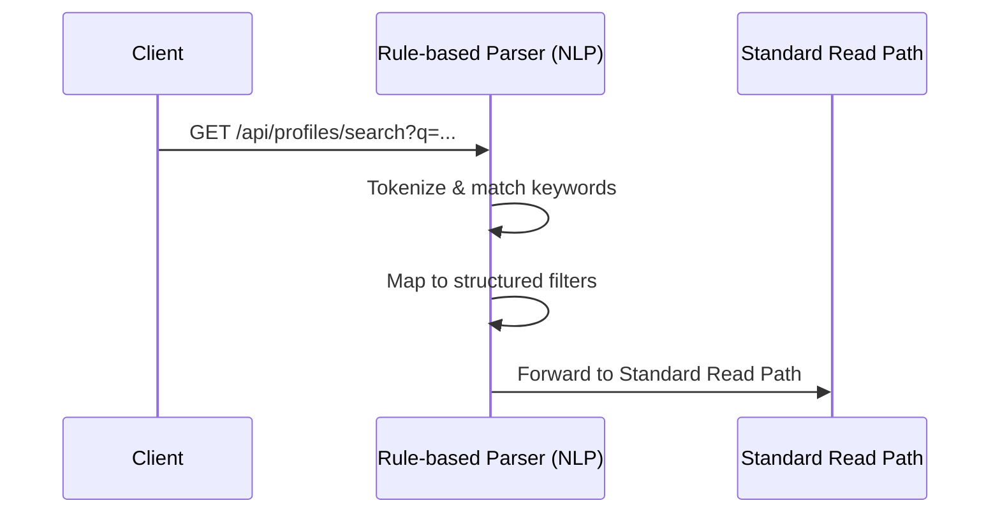

# Scaling Insighta Labs+: System Design Under Growth
**Stage 4a — Backend Engineering Track**
**Author:** cybarry
**Date:** May 2026

---

## 1. Requirements

### Functional Requirements
- Accept structured filter queries (gender, age, country, age group) and return matching profiles
- Support combined filter + aggregation queries
- Support natural language inputs mapped to structured filters via rule-based parsing
- Authenticate all requests via GitHub OAuth with short-lived JWT tokens
- Enforce role-based access control (admin vs analyst)
- Serve data through three interfaces: REST API, CLI, Web Portal
- Support CSV export of filtered results
- Handle periodic profile ingestion without disrupting query availability

### Non-Functional Requirements

| Requirement | Target |
|---|---|
| P50 query latency | < 500ms |
| P95 query latency | < 2 seconds |
| Dataset size | Tens of millions of profiles |
| Query load | Hundreds to low thousands per minute |
| Availability | High — daily usage by multiple teams |
| Read/Write ratio | Read-heavy (~95% reads, ~5% writes) |
| Deployment | Single-region, managed services |

---

## 2. Architecture

### High-Level Diagram



### Core Components

**Nginx (Reverse Proxy):** Sits in front of everything. Clients never talk directly to the API server — they talk to Nginx. Nginx handles SSL termination, rate limiting, and forwards requests to the API server. This hides the backend from direct exposure to the internet.

**API Server (Fastify):** Handles auth verification, role checks, API versioning, and routes requests to the correct handler. Stateless — holds no data, only processes requests.

**In-Memory LRU Cache:** Stores results of frequent read queries directly in the Node.js process RAM (via `lru-cache`). This avoids external DB dependencies while delivering sub-10ms response times for repeated queries.

**PostgreSQL (with Connection Pooling):** Handles both reads and writes. To support concurrency without connection starvation, the Knex adapter utilizes connection pooling (`min: 2, max: 20`). Composite indexes are explicitly created for common analytical intersections.

---

## 3. Consistency Model (CAP Theorem)

The system is read-heavy and not real-time. Applying CAP theorem:

- **Partition Tolerance** is always required in distributed systems — network issues will happen.
- Between **Consistency** and **Availability**, this system chooses **Availability (AP)**.

Reason: Analysts querying demographic profiles do not need the absolute latest data at every millisecond. If a profile was just created by an admin, it is acceptable for it to appear in search results within a few seconds (replication lag) or up to 60 seconds (cache TTL). The system must remain available and fast for all analyst users regardless of what the admin is doing.

This is eventual consistency — all replicas will have the same data eventually, just not instantly.

This would be the wrong choice for a banking system where a transferred balance must be immediately visible. For demographic analytics, it is the right tradeoff.

---

## 4. Data Flow

### Read Path (Query Flow)



### Write Path (Ingest Flow)



### Natural Language Query Flow



---

## 5. Design Decisions

### Decision 1 — Vertical Scaling & Connection Pooling (No New Infrastructure)

**Requirement:** Handle hundreds to thousands of queries per minute with P95 < 2s.

**Reasoning:** To meet the strict "no new database systems" constraint from Stage 4B, we avoided provisioning a Master-Slave cluster. Instead, we scaled our single database connection via Knex connection pooling (`min: 2, max: 20`). This handles high concurrency efficiently while maintaining a simpler infrastructure footprint.

**Trade-off:** A single database node represents a single point of failure and mixes read/write contention. We mitigate write contention during heavy CSV ingestion by batching inserts and yielding the Node event loop, allowing read queries to interleave without starvation.

---

### Decision 2 — In-Memory LRU Cache + Query Normalization

**Requirement:** P50 < 500ms, reduced database load without external caching infrastructure.

**Reasoning:** Since we cannot use an external Redis cluster, we implemented `lru-cache` within the Node.js process itself. Serving from RAM is orders of magnitude faster than querying disk.

To maximize cache hit rates, a **deterministic query normalizer** was built. It sorts and standardizes filter keys before generating the cache key. Thus, "Nigerian females aged 20-45" and "Women 20-45 in Nigeria" hit the exact same cache block, heavily reducing redundant DB execution.

**On write:** Any `POST`, `DELETE`, or bulk CSV `upload` operations invoke a global `clearCache()` to ensure data consistency without overcomplicating cache invalidation tracking.

**Trade-off:** Local memory caches are bound to the Node process. If deployed across multiple isolated containers, cache state isn't shared (though eventually consistent). Clearing the entire cache on writes is a blunt invalidation tool, but practical given the massive read-heavy skew of the system.

---

### Decision 3 — Composite Database Indexes

**Requirement:** Query performance at tens of millions of rows.

**Reasoning:** The resource explains that without indexing, a database performs a full table scan — checking every row — which is O(N). With an index, the database uses a B-tree structure and can find results in O(log N). At tens of millions of rows the difference between these is the difference between a 5-second query and a 50ms query.

The current schema has individual indexes on `gender`, `age_group`, `country_id`, and `age`. When a query filters on multiple columns simultaneously, PostgreSQL can only use one index and must filter the rest in memory. Composite indexes solve this for the most common filter combinations:

```sql
CREATE INDEX idx_gender_country ON profiles(gender, country_id);
CREATE INDEX idx_gender_age_group ON profiles(gender, age_group);
CREATE INDEX idx_country_age_group ON profiles(country_id, age_group);
CREATE INDEX idx_gender_country_age_group ON profiles(gender, country_id, age_group);
```

**Trade-off:** Each additional index slightly slows down writes because every INSERT must update all relevant indexes. Since writes are low-volume and admin-only, this cost is negligible.

---

### Decision 4 — Nginx as Reverse Proxy

**Requirement:** Security, rate limiting, single entry point.

**Reasoning:** The resource defines a reverse proxy as a server that sits in front of the backend — clients talk to the reverse proxy, not directly to the application server. The backend is never directly exposed to the internet. Nginx provides SSL termination (handling HTTPS so the application server only sees plain HTTP internally), rate limiting, and request routing.

This is already partially handled in Fastify's rate limiting plugin. Moving the outer layer to Nginx is a standard production pattern that adds no application complexity and provides a hardened perimeter.

**Trade-off:** One additional network hop per request. The latency cost is under 1ms and is far outweighed by the security and operational benefits.

---

### Decision 5 — No Microservices, No Message Queues

**Requirement:** Simplicity and maintainability.

**Reasoning:** The resource is explicit: "Most startups start with a monolith... When to use Microservice? When we want to avoid single-point failure [and] when no. of teams increases." This system has one backend team, one database, and one set of features. Breaking it into microservices would add network hops, distributed tracing complexity, and deployment overhead with no benefit.

Similarly, message brokers are appropriate for "non-critical tasks that can be done asynchronously" and "tasks that take a long time to compute." Profile creation (calling three external APIs and inserting one row) completes in under 2 seconds synchronously. There is no long-running job that needs to be queued. Adding a message broker here would be adding infrastructure to solve a problem that does not exist.

---

## 6. Trade-offs and Limitations

### What this design handles well
- Read-heavy workloads with repeated analyst query patterns
- Growing dataset up to tens of millions of rows with proper indexing
- Concurrent analyst sessions without database contention (read replica)
- Low write volume with fast synchronous response (admin-only creation)
- Cache hit rate reduces database load significantly for common queries

### What this design does not handle well

**High-volume writes:** If profile ingestion ever becomes high-volume (thousands per minute), the synchronous write path to a single master becomes a bottleneck. The resource recommends sharding for write-heavy traffic. At that point, a write queue (simple async job) would decouple the external API calls from the database insert. This is not needed now.

**Aggregation queries at scale:** "Count of all adult males grouped by country" across tens of millions of rows is expensive even with indexes. At that scale, a materialized view refreshed on a schedule would pre-compute common aggregations. This adds complexity not justified by current query patterns.

**Master failure:** A single master is a single point of failure for writes. If the master goes down, writes fail until failover completes. Railway's managed PostgreSQL handles failover automatically but with potential downtime of 30–60 seconds. A hot standby with synchronous replication would reduce this but adds cost. Acceptable at this stage.

**Cache stampede:** If many requests arrive simultaneously for the same uncached query (e.g., after cache expiry), all of them hit the database at once. A simple mutex or probabilistic early expiration can prevent this. Intentionally excluded for simplicity — it is an edge case at current traffic levels.

---

## 7. Bonus — Future Evolution

### Real-Time Analytics
If the product needed real-time dashboards (e.g., "how many profiles created today, live"), the addition would be an event stream pattern. Each write event (profile created, deleted) would be published to a lightweight queue. A consumer worker would update pre-computed counters in Redis. The dashboard would read counters from Redis rather than running COUNT queries against the database on every page load.

The resource describes this as event-driven architecture — the producer (ingest layer) emits an event, and consumers (counter workers) process it asynchronously. The database layer does not change. This only makes sense when write volume is high enough to make live COUNT queries expensive.

### True Natural Language Query System
The current rule-based parser maps a fixed vocabulary to structured filters. To evolve:

**Step 1 — Near-term:** Expand keyword coverage and add fuzzy matching for country names and synonyms. No infrastructure change required.

**Step 2 — Medium-term:** Replace the parser with a small classification model deployed as a sidecar service. The API sends the raw query string, receives a structured filter object back, and proceeds with the existing query pipeline unchanged. The database layer is untouched.

**Step 3 — Long-term:** If semantic similarity search is needed (find profiles similar to a description), the pgvector PostgreSQL extension would add vector search capability to the existing database without a separate vector store. This is only justified if structured filters genuinely cannot serve the use case.

The core principle: the query pipeline and database stay constant. Only the input parsing layer evolves.
